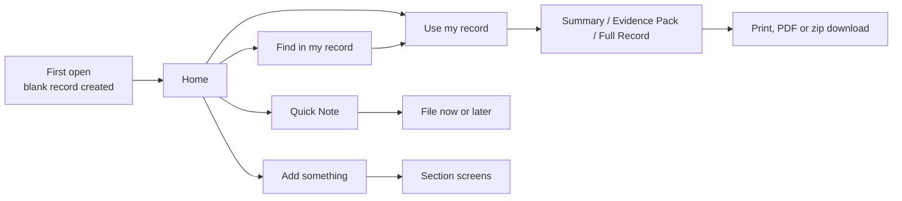

# Say It Once — Specification of the current app (v53 / P2-C42)

Sep 25, 2026 · @Stuart

## Status and how to read this

This spec describes what the shipped build actually does, derived from reading all of it: `index.html` (4,575 lines, build marker `P2-FINAL-TI-2026-09-06` / `P2-C42-2026-09-06`), `sw.js` and `manifest.webmanifest` from `Say-It-Once-MASTER.zip`. All 35 script blocks and 47 style blocks were read. Where the code and the in-app help text disagree, the code is described and the help text is noted as wrong.

Three kinds of statement appear below:

- **Behaviour** — what the running app does today. This is the rebuild baseline unless you decide otherwise.
- **Dead code** — present in the file but unreachable in the final build. Listed so nobody ports it by accident.
- **Question (Qn)** — ambiguous or contradictory behaviour. Collected in the last section. Nothing is guessed.

The known defects you listed are confirmed and not repeated here except where the detail matters. New defects are in the "Defects found" section; two of them break the "Keep this private" promise today.

## How the current code is structured

The app is one page that rebuilds `#main` with `innerHTML` on every render. Later script blocks reassign global functions, so the last assignment wins — except where a patch reassigns a name that an earlier block captured in a closure, in which case the patch is silently ignored.

| Block | Label in file | What it does | Effective? |
| --- | --- | --- | --- |
| 0 | v53 base (258 KB) | Storage, all views, all forms, report text, backup, dictation, read-aloud | Base for everything |
| 1 | "Definitive prototype layer" | New Home, Add something, Find in my record, audience flow, private flags, IIDB work details, impact corrections | Yes; its Use-my-record page was later replaced |
| 2 | "Use My Record critical pass" | Scored auto-selection (`CRIT_PROFILES`), review → draft → final check → ready, zip pack | Yes, via "Help me choose" only |
| 3 | Candidate 1 | Preserves appointment form values across camera/file picker | Yes |
| 4 | Candidate 3 | Purpose-specific section order; lighter ending on Summaries; print guide v3 | Order function unreachable by later blocks (closure) |
| 5 | Candidate 4 | Moves "Help me choose" cards into a collapsible panel | Yes |
| 6 | Candidate 5 | E1/E2 evidence references; Full Record embeds all non-private files | Report part yes; zip part dead (closure); its `openReportWindow` crashed and was replaced |
| 7 | Candidate 6 | Opens report window before awaiting files | Replaced (referenced out-of-scope helpers) |
| 8 | Candidate 7 | Self-contained `openReportWindow` | **Final report launcher** |
| 9 | Candidate 8 | Evidence index in contents | No-op (its regexes match class names never generated) |
| 10–11 | Candidates 9–10 | Searchable FAQ; print guide v5 in a new window | Yes |
| 12–13 | Candidates 11–13 | "Dictation hardening" | Empty — nothing implemented |
| 14 | Candidate 15 | Injects Back and Home buttons into every modal | Yes |
| 15–34 | Markers | Version strings only | — |

The final `reportSourceHtml` is a stack of five wrappers (blocks 9 → 6 → 4 → 2 → 1 → 0). Block 2 short-circuits every purpose except `all` (Full Record), so for Full Record the block 0 renderer runs with block 1's IIDB insert.

## User journey

The journey is capture first, organise later, share selectively. Nothing is mandatory and no step blocks another.



1. **First open.** A record called "My record" is created silently. If older storage exists it is migrated first (see Backup section). No sign-up, no name prompt on the current Home.
2. **Capture.** From Home the person uses Add something (a chooser of eight kinds) or Quick Note (text, dictation or a photo, saved unfiled). Every form says a few words are enough.
3. **Organise.** Quick Notes can be filed to a section, and for How it affects me optionally to one of 13 areas. Unfiled notes are surfaced on Home with an orange File prompt. Photos in Quick Notes can be turned into an appointment or a document.
4. **Keep up to date.** "Something has changed" snapshots the current impact position before overwriting it, so a history builds. Health & wellbeing check-ins add dated readings.
5. **Find.** Search across the record with simple question answering (last/first, how much, current medication, who is my X).
6. **Use.** Choose Summary, Evidence Pack or Full Record, or "Help me choose" by audience. Review, then open a print view or download a zip.
7. **Protect.** Backup to a JSON file, restore on another device, delete a record or everything. Multiple records per device (one per incident).

## Screens

There are 14 routable screens, addressed by URL hash with browser history. Every screen except Home has Back and Home buttons at the top, a "Listen to this section" control under the heading, and, when more than one record exists, a "Record: name" tag. Focus moves to the `h1` after every navigation.

| Hash | Screen | Contents |
| --- | --- | --- |
| `home` | Home | Headline "Keep everything together, so you don't have to start again." Four tasks: Add something, Quick Note, Find in my record, Use my record. Latest Quick Note (with File button if unfiled) and "View all". Next upcoming appointment. Support services card. "Keep Say It Once on your phone" prompt with Not now (not shown when installed). Footer: How to use, FAQ, Add to phone, Privacy & backup, strapline, copyright. |
| `what` | What happened | Date, time (optional), place; "What happened?"; "What happened next?". Collapsed "Treatment and what came next": treatment, complications, ongoing care. Collapsed "Other details": injuries/symptoms, beforehand, told, other people there, services. Each textarea has Dictate. Autosaves on every keystroke. Quick notes filed here. |
| `impact` | How it affects me | "Choose an area that's changed" button; free-text "Describe it in your own words" with Dictate and Add photo; list of filled areas with Edit; Health & wellbeing card; "Something has changed" and "See changes over time" links; quick notes filed here. |
| `track` | Keep track | Four cards with counts: Appointments, Treatment & medication, Letters & documents, Costs & lost income (shows £ spent and £ lost). Contacts link. |
| `diary` | Appointments | Add appointment; Quick Note link; Upcoming list (date ≥ today) with Edit, Add to my calendar, View letter, Delete; collapsed "Earlier appointments & notes" with live search. |
| `treatment` | Treatment & medication | Treatment card (Add, Repeat previous, the "straight afterwards" entry from What happened, list with Edit). Medication card (Add, list with Edit). |
| `costs` | Costs & lost income | Toggle Money I spent / Income I lost; inline form (date or from-date, description, amount £, optional to-date, evidence description, link to a document). Totals. Collapsed list with Delete. Drafts persist between visits. |
| `docs` | Letters & documents | Take photo; Choose file or add manually; list with View document and Edit details. |
| `people` | Contacts & important numbers | Inline form (organisation/person, phone/email, role, reference). List with tel:/mailto: links, Add to my contacts (vCard), Delete, Print contact list. Drafts persist. |
| `packs` | Use my record | Summary, Evidence Pack, Full Record cards; collapsible "Help me choose" with six audiences plus "Tell me what I need" and "Create a personal overview"; "Continue preparing…" banner if a build is in progress this session. |
| `support` | Find support | Urgent help (NHS 111 link, call 999); collapsible categories: mental health (Mind, Samaritans 116 123), brain injury & stroke (Stroke Association, Headway), spinal (SIA), cancer (Macmillan), disability & caring (Scope, Carers UK), neurological (Parkinson's UK, MS Society). |
| `privacy` | Backup & privacy | Where is my record; Save a backup copy; Restore my record; privacy statements; Delete this record; Delete all Say It Once data from this device. |
| `journey` | How to use | Four steps (Record it, Keep it together, Find it, Use it); link to FAQ; Print guide. |
| `faq` | FAQ | Search box with live count; six topic groups, about 40 questions as expandable items. |

Dead views still in the file: `viewRecord` ("My record"), the old four-part Home, `showProgress`, the 12-area inline impact editor (`data-set`, `data-set-na`), the free-form diary note form, and the `sealed`/"reseal" What happened lock.

## Dialogs and flows

About 35 dialogs carry most of the data entry. All use one overlay pattern; most call `trapModal` (see Accessibility). Validation messages are 2.8-second toasts.

| Dialog | Fields and rules |
| --- | --- |
| Add something | Eight choices: What happened (navigates), Appointment, Treatment & medication (→ Treatment or Medication), Something has changed (→ change picker, or Impact screen if nothing recorded), Letter or document (→ Take photo or Choose file), Cost (navigates), Contact (navigates), Quick Note. |
| Quick Note | Text; Dictate; Add photo (camera, image only, size cap); Keep this private. Buttons: Save as Quick Note, File this now. Requires text or photo. |
| File this quick note | Seven destinations: What happened, How it affects me (→ optional area picker of 12 areas + "Something else" + "Not sure"), Appointments, Treatment & medication, Letters & documents, Costs & lost income, Contacts. "Remove from section" unfiles. A second, three-way picker (`QUICK_NOTE_MAIN_ROUTES` / `TRACK_ROUTES`) exists but is only reached from dead code. |
| Quick notes list | All notes newest first with location, View photo, Open section, File, Edit, Delete (confirm; deletes photo). |
| Photo: what is this? | Only from dead code paths now. Appointment (date and organisation required; creates appointment + linked document, removes the note), Letter or document, Keep as Quick Note. **Q1** |
| Appointment | Letter photo or file (optional, PDF/JPEG/PNG/WEBP); date (required); time; who with (required, suggestions from previous appointments and contacts); purpose; collapsed type (In person / Phone / Video / Other), person seen, location; collapsed after-appointment "what I was told" and "what happens next" with Dictate; Keep this private. Saving creates or updates a linked document titled "Appointment letter — {org}" and copies the private flag to it. Then a "Saved. That's enough for now." dialog with Add to my calendar if upcoming. |
| Treatment | Name (required); date; collapsed effect (six options) and note; Keep this private; Delete (confirm). "Repeat previous" lists up to 10 distinct names and pre-fills name + today. |
| Medication | Name (required); for what; collapsed status (4 options), dose, how often, started, effect (6 options), side effects; Keep this private; Delete. |
| Impact area | 12 areas (see Data). Difficulty (4 options), "Tell us what happens" + Dictate; collapsed help needed, aid/equipment, how often (4 options), safety/repeatability, time it takes, completing it properly; Keep this private. Requires at least one value. Opening Edit on an existing area first asks: "Something has changed" (snapshot + update) or "I'm correcting what I wrote" (hidden revision + overwrite). |
| Something else this has changed | Single text + Dictate. Offered in the area picker only while the free-text field is empty. |
| Something has changed | Choose: Physical or mental wellbeing (→ check-in), any filled area (→ area editor as a change), "Something else". |
| Health & wellbeing check-in | Pain Low/Medium/High; How I feel Good/Okay/Struggling; pulse 20–250 bpm (collapsed); note. Needs one value. No private option. |
| Changes over time | Read-only: check-ins, each earlier impact snapshot, current position. |
| Impact photo | Image + caption; saved as a document with `relatedSection: impact`. |
| Take photo (document) | Camera image, optional name (default "Photo document — date"), note, Keep this private. |
| Document | File (PDF/image), name; collapsed date, important point, from, relates to (What happened / Treatment / How it affects me / Appointments / Costs / Other), important wording, paper copy location, act-by date, done/no action; Keep this private; Delete (confirm; also unlinks from appointments and costs). Needs a file or a name. |
| Find in my record | Search box + Dictate; example questions; Recent and Often needed; results or timeline view; type filters; "Use these results" (→ Summary or Evidence Pack of non-private matches). |
| My records | Person's name (applies to every record); open, rename, delete (not the last), add another record. Only reachable from dead code. **Q2** |
| IIDB work details | Offered once when IIDB is chosen and employer/job/workplace are empty. Employer, job, workplace; collapsed employment start/end, payroll number, reported at work (Yes/No/Not sure), reported to, date, work since. |
| Report builders | See Report variants. |
| Confirm box | Title, text, Cancel / action. Used for every delete and restore. |
| Come back to Say It Once | Device-specific install instructions (iOS Safari, Android Chrome, Samsung Internet warning, other), backup prompt. |

## Data entities and fields

One device holds an **index** and any number of **records**. Each record is a single JSON document; attachments are stored separately. All dates are ISO `YYYY-MM-DD` strings, times `HH:MM`, timestamps ISO 8601. Amounts are strings parsed with `parseFloat`. IDs are 8 random base-36 characters with a prefix.

**Index** — `{version: 53, activeId, records: [{id: "rec-…", name, created, updated, legacyImported}]}`

**Record (top level)** — `who.name`; `lastUpdated`; `lastBackup`; `impactOther` (text); `impactOtherPrivate` (bool, no UI sets it); `impactCurrentSince` (date); `sealed` (dead); `sectionStates` (dead); `drafts` (unsaved Contacts and Costs form contents); `productMeta.preDefinitiveIds` (IDs that existed before block 1 shipped, used to avoid back-filling `recordedAt`).

| Entity | Collection | Fields |
| --- | --- | --- |
| Incident (one) | `incident` | date, time, place, before, what, after, told, injuries, witnesses, services, treatment, complications, ongoingCare, recordedAt; dead: treatmentEffect, treatmentEffectNotes |
| Impact area (map, one per area) | `impact.{key}` | difficulty, detail, help, aid, often, safety, timeLonger, standard, private; dead: na |
| Impact snapshot | `impactHistory[]` | id `impact-`, date (the *previous* position's since-date), recordedAt, impact (full copy of the map), impactOther |
| Impact correction | `revisions[]` | id `revision-`, type `impact-correction`, area, correctedAt, before (the overwritten area object). Never displayed. |
| Check-in | `checkIns[]` | id `check-`, date, createdAt, pain, feeling, pulse, note; legacy physical, mental |
| Appointment | `diary[]` kind `appointment` | id `appt-`, date, time, organisation, person, purpose, location, type, told, next, docId, private, recordedAt; derived duplicates who (= organisation) and what ("Appointment: purpose with person") |
| Diary note (legacy) | `diary[]` no kind | id `diary-`, date, who, what. Can no longer be created; still displayed, searched and reported. |
| Treatment | `treatments[]` | id `treat-`, name, date, effect, changed, private, recordedAt |
| Medication | `medications[]` | id `med-`, name, forWhat, status, dose, often, started, effect, sideEffects, private, recordedAt |
| Cost / lost income | `costs[]` | id `cost-`, kind `expense` or `income`, date, dateTo (income only), item, amount, receipt (evidence description), docId; private is read by reports but no UI sets it |
| Document | `docs[]` | id `doc-`, title, from, date, says, quote, where, reply (act-by date), replied (bool), file `{name,type,size}`, safeFile `{name,type}` (legacy only), relatedSection, relatedId, photoCapture, sourceQuickNoteId, private, recordedAt |
| Contact | `refs[]` | id `ref-`, org, role, ref, contact; private is read by reports but no UI sets it |
| Quick Note | `quickNotes[]` | id `quick-`, text, createdAt, updatedAt, section (what/impact/diary/treatment/docs/costs/refs or empty), impactArea (area key, `other` or empty), photo `{name,type,size}`, docId (set when photo promoted), private, recordedAt |
| IIDB work details | `purposeDetails.iidb` | employer, workplace, jobTitle, employmentStart, employmentEnd, payrollRef, accidentReported (Yes/No/Not sure), reportedTo, reportDate, employmentSince, recordedAt |

**Fixed vocabularies**

- Impact areas (key → label): food Preparing food; eat Eating and drinking; therapy Managing treatment and medication; wash Washing and bathing; toilet Using the toilet; dress Dressing and undressing; speak Speaking and being understood; read Reading and understanding information; people Mixing with other people; money Managing money; journey Going out and getting around; move Walking and moving around. These mirror the PIP descriptors; each has a one-line prompt.
- Difficulty: I manage this · It is harder now · I find this very difficult · I cannot do it at all (legacy "I struggle badly" migrates to the third).
- How often: Now and then · Most days · Every day · It varies a lot.
- Treatment and medication effect: Helped a lot · Helped a little · No real change · Made things worse · Too early to tell · Not sure (legacy "No noticeable change", "Too soon to tell" migrate).
- Medication status: Still taking · Stopped · Take when needed · Not sure.
- Appointment type: In person · Phone · Video · Other.

**Normalisation on load** — missing arrays and objects are defaulted; legacy vocabularies are renamed as above; `quickNotes[].sections[0]` becomes `section`; missing `docId` and `relatedSection` are set to empty.

## Attachments and storage

Attachments are stored as base64 data URLs, one key per file, in an IndexedDB object store `kv` in database `say-it-once-v53-fresh-new-user`. If IndexedDB fails the app falls back to `window.storage`, then `localStorage`, then an in-memory object — and still reports success.

| Key | Holds |
| --- | --- |
| `sio-v53-fresh-new-user-home-refined-index` | The index |
| `sio-v53-fresh-new-user-home-refined-record-{recordId}` | One record's JSON |
| `sio-v53-fresh-new-user-home-refined-file-{recordId}-{docId}` | A document's file |
| `…-file-{recordId}-{docId}::safe` | A redacted copy (legacy data only; nothing creates these now) |
| `…-file-{recordId}-quick::{noteId}` | A Quick Note photo, until promoted to a document |
| `sio-v53-large-text`, `sio-v53-focus-reading` (localStorage) | Display preferences |
| `say-it-once-return-prompt-v1` (localStorage) | "Add to phone" prompt dismissed |
| `sio-def-access-{recordId}` (localStorage) | Search history: item IDs, titles, open counts, timestamps |

**Limits** — 12 MB per file (2 MB if IndexedDB is unavailable). Documents accept PDF, JPEG, PNG and WEBP; camera captures accept any image type.

**Promotion** — when a Quick Note photo becomes a document, the file is copied to a new `doc-` key, the note gets `docId`, the `quick::` key is deleted, and the note's private flag is copied to the document.

**Linking** — documents link to one place via `relatedSection` + `relatedId`. Appointments and costs link back to a document via `docId`. Adding a cost with a document sets the document's `relatedSection: costs` only if it had none.

## Report sections and what goes in each

Every report is built from up to 11 standard sections plus four purpose-only sections. Each generator produces flattened text; a later renderer re-detects headings by matching known English labels (your known defect). An empty section is omitted.

| Key | Default title | Content (effective version) | Private filter |
| --- | --- | --- | --- |
| `account` | What happened | Labelled paragraphs in this order: When and where (date · time · place), Beforehand, What happened, What happened next, Complications, What were you told at the time, Other people there, Police/ambulance/fire. Then filed Quick Notes. | None — incident has no private flag |
| `chronology` | Chronology | Every dated event sorted by date, time, then type priority: incident; appointments (time, type, org, person, told, next); legacy notes; treatments; impact snapshots ("earlier position saved"); check-ins; medication start dates; documents (except appointment letters); costs and lost income with amount. | **None** |
| `injuries` | Injuries and symptoms | `incident.injuries` verbatim. | None |
| `impact` | How it affects me | Per filled area: label, difficulty, detail, "Help I need", "Aid or equipment", "How often", "Doing this safely and more than once", "Time it takes", "Completing it properly". Then "Anything else this has changed for you?" free text. Then filed Quick Notes. | Area `private`; free text via `impactOtherPrivate` |
| `changes` | Changes over time | Check-in summary (count, date range, latest values, first→latest change in pain and feeling, latest note). Then each impact snapshot rendered as above, titled "Earlier position" / "Previous position — date". | Snapshots use the flag stored in the snapshot; check-ins **none** |
| `treatment` | Treatment & medication | "Treatment" (straight afterwards), "Ongoing care", "Later treatment" (date — name — effect, note), "Medication" (name · dose · often · for · status · started · effect · side effects). Then filed Quick Notes. | Treatments and medications |
| `diary` | Appointments | Every appointment and legacy note, oldest first: date · time — org; type, person, purpose; what I was told; what happens next; "Appointment letter linked". Then filed Quick Notes. | Yes |
| `costs` | Costs & lost income | "Money I spent" and "Income I lost" lists (date\[ to date\] — item — £amount · evidence description), then totals spent, lost, combined. Then filed Quick Notes. | Yes (flag has no UI) |
| `refs` | Contacts & important numbers | One line per contact: org · role · Ref x · contact. Then filed Quick Notes. | Yes (flag has no UI) |
| `quicknotes` | Quick notes | Unfiled notes, oldest first: date · time, text, "Photo saved with this quick note." | Yes |
| `docs` | Letters & documents | Numbered, oldest first: title — date — from; Relates to; important point; "Important wording" in quotes; digital file attached or paper copy location. Then filed Quick Notes. | Yes |
| `snapshot` | Current position / How things are now | Names only: impact areas recorded, current medication, three most recent treatments, two most recent appointments. Injury, insurance and self purposes. | Yes |
| `workcontext` | Work at the time of the accident | IIDB work details as label/value pairs. IIDB only. | n/a |
| `cost-summary` | Financial impact / summary | Entry count and three totals. Injury and insurance purposes. | Yes |
| `costs` (detail) | Detailed costs and lost income | As `costs` without totals. | Yes |

**Healthcare variant** — for the healthcare purposes the old flow uses shorter generators: appointments show the next two upcoming plus four most recent only; changes shows check-ins only (no snapshots); section titles change ("Current position", "Recent changes", "Appointments & next steps", "Relevant background", "Relevant documents").

**Sensitive-content flags** — separate from private. Impact areas `toilet` and `people`, and any text matching bowel, bladder, continence, toilet, catheter, mental health, anxiety, depression, counselling, distress, sexual, intimacy, income, wage, salary or financial, are labelled "personal" in search and in the final-check warning. Financial is only warned for injury and insurance purposes. Nothing is excluded by this; it only warns.

## Report variants, purposes and flows

Five routes produce reports today, built on two incompatible purpose systems. The route decides the title, the section order, whether a pre-share check happens and which privacy rules apply.

| Route | Steps | Output |
| --- | --- | --- |
| A. Create a Summary | Purpose (7 options) → section checklist (Suggested / Optional / Nothing recorded yet) → optional "Choose specific entries" → open | A4 print view titled "Record Summary". No pre-share check. |
| B. Create an Evidence Pack | Same purpose list, "1 of 3" → sections → optional entries → document checklist, all ticked → download | Zip: report HTML + `attachments/NN-name.ext`. No pre-share check. |
| C. Review Full Record | Warning ("can contain much more personal information…") → open | A4 print view of everything, all non-private files embedded, signature block. |
| D. Help me choose | Audience (6 + "personal overview" + free-text "Tell me what I need") → need → IIDB details offer → automatic selection → Review → Draft ("Does this give them what they need?") → Final check → Ready | View report (reading view), Open A4 print view, and for evidence profiles "Download report + N supporting files". |
| E. Find → Use these results | Non-private matches → Summary or Evidence Pack → "Before you share or save" check | As A or B with purpose `custom`. |

**Purposes offered in route A/B** — Appointment or conversation (`health`), Benefits, support or a form (`pip`), Solicitor or injury claim (`injury`), Insurance (`ins`), Employer or occupational health (`work`), For myself (`self`), Something else (`custom`). Default sections come from `PACK_SECTIONS`, reduced to sections that have content:

| Purpose | Default sections |
| --- | --- |
| health, self, custom | account, treatment, impact, changes, diary |
| pip | injuries, treatment, impact, changes, docs |
| injury | chronology, account, injuries, treatment, impact, costs, docs |
| ins | account, treatment, costs, refs, docs |
| work | treatment, impact, changes, diary |

Also defined but unreachable: `iidb`, `wca` (Work Capability Assessment), `aa` (Attendance Allowance), `medneg`, `family`, `otherbenefit`. **Q3**

**Profiles in route D** — each has a title, a summary/evidence kind, an intro sentence, keywords and per-section selection rules.

| Audience | Need → profile title | Kind |
| --- | --- | --- |
| Healthcare | Prepare for an appointment → Appointment brief; Short health overview → Health overview; What has changed → Recent changes summary | Summary |
| Benefits / DWP | PIP claim or review → PIP support pack; Industrial Injuries → IIDB support pack | Evidence |
| Benefits / DWP | Another benefit or form → Focused record summary | Summary |
| Solicitor / legal | Personal injury claim → Personal injury case summary; Concerns about medical treatment → Medical treatment concerns summary | Evidence |
| Insurance | Overview → Insurance claim summary | Summary |
| Insurance | Costs or lost income → Costs and lost income summary; General evidence → Insurance evidence pack | Evidence |
| Work / OH | Work and Occupational Health summary | Summary |
| Family | Family support overview | Summary |
| (link) | Personal overview | Summary |

"Tell me what I need" maps free text to a need by keyword regex (pip, industrial/iidb, negligence, solicitor, insurance + loss, occupational/employer, consultant/doctor/GP, family/carer; otherwise `custom`).

**Automatic selection (route D)** — for each section the profile names a mode and a limit. Items are scored: recency (up to 12 points, minus 2 per year old); 10 per profile keyword found; 4 per word shared with already-selected items; +24 current medication; +3 appointment; +4 photo on evidence profiles; documents +18 if related to a chosen section, +30 if linked to a selected item, +8 for words like report/letter/scan/receipt, +3 if a file is attached; contacts +8 and appointments +6 for clinical or legal words; sensitive items −25 for work and −8 for family and insurance overview. Modes: `all` (up to N), `recent` (newest N), `currentRecent` (current medication first, then score), `recentRelevant` (score ≥ 10 then newest), `relevant` (top N), `strong` (score ≥ 14), `docs` (score ≥ 13 or evidence-type words, at least two), `account` (fixed incident fields), `whole`/`derived` (injuries, chronology). **Q4**

**Section order** — route D profiles impose their own order, for example PIP: impact, changes, treatment, refs, diary, quick notes, docs; injury: current position, account, injuries, impact, treatment, changes, financial impact, refs, diary, quick notes, docs, detailed costs, chronology. Full Record: account, chronology, injuries, impact, changes, treatment, diary, costs, refs, quick notes, docs. Other purposes use a per-purpose order table.

**Titles in route B** — the zip reuses route D's profile title, so an Evidence Pack for Appointment or Insurance is titled "Focused record summary".

## Inclusion and privacy rules as implemented

The promise shown to users is "items marked private are excluded automatically from generated reports". The code keeps that promise in route D and breaks it in routes A, B and C. There is no route that lets a user deliberately include a private item.

**What can be marked private** — appointments, treatments, medications, documents, Quick Notes and impact areas. Not: the incident account, injuries, check-ins, the free-text impact note (flag exists, no control), costs and contacts (flag honoured, no control), IIDB work details.

**How filtering works** — two mechanisms, applied inconsistently:

1. *Section text generators* skip private items (see the table in Report sections). This is the only protection in routes A, B and C.
2. *Selection filtering*: the report temporarily swaps the global record for a copy containing only selected item IDs. Selectable-item lists never offer private items, so when a per-item selection exists, private items are removed before any generator runs. Route D always has one. Routes A, B and E have one only if the user opened "Choose specific entries"; otherwise the copy only blanks sections that were not ticked.

**Consequences, by route**

| Leak | Route A Summary | Route B Evidence Pack | Route C Full Record | Route D |
| --- | --- | --- | --- | --- |
| Private appointments, treatments, medication start dates, documents and costs in the **chronology** | When chronology is ticked (default for injury) and the matching section is ticked | Same | **Always** | No |
| Private **document files and titles** in the zip | n/a | **Yes — private documents are listed and pre-ticked** | n/a | No |
| Impact areas made private after a snapshot, via **Changes over time** | Yes if Changes ticked | Yes | Yes | Yes (snapshot text) |
| Check-in notes | Always (no control) | Always | Always | Always |

**Other inclusion rules**

- **Quick Notes vanish in routes A, B and E** unless specific entries were chosen: the selection copy keeps only Quick Notes whose IDs were selected, and none were. This includes the "Quick notes" section itself. Full Record includes them all.
- **Documents in each section** — a "Related documents" / "Supporting evidence" list follows a section when a non-private, selected document has a matching `relatedSection`, or is linked from an appointment (diary) or cost (costs). Mapping: account, witnesses, services and injuries ← `what`; treatment ← `treatment`; impact ← `impact`; diary ← `diary`; costs ← `costs`; refs ← `people` (no UI sets `people`).
- **Evidence references** — in A4 evidence reports, selected documents are numbered E1, E2… in date order, and links get an E prefix. The zip's index uses plain numbers (the E-reference version of the zip was never wired in).
- **Full Record documents** — every non-private document is listed and every attached file is embedded in the page as base64.
- **"Meaningful" documents** — a document counts only if it has a title, sender, note, wording, file or paper location. Others are ignored everywhere.
- **Appointment letters** are excluded from the chronology when linked to an appointment, to avoid a duplicate.
- **Empty sections** are dropped, and a section checkbox is disabled with "Nothing recorded yet" when its generator returns nothing.
- **Sensitive-content warning** appears in route D's final check and reading view, and in route E's pre-share check, listing kinds of personal information. It never removes anything. Routes A and B show no warning.

## Output renderers

Three renderers turn the same sections into different documents. Each opens with `window.open` + `document.write`, loads Google Fonts from the internet, and says nothing if the fonts fail.

| Renderer | Used by | Layout | Header and ending | Documents |
| --- | --- | --- | --- | --- |
| A4 paginated view | Routes A, C, D ("A4 print view"), E | Content laid out off-screen, then split into 210 × 297 mm pages by measuring overflow; sections continue across pages as "— continued"; page header with logo, title, record name; footer "Page X of Y"; contents page with page numbers when there are 5+ sections (Full Record) or 6+ (profiles). Toolbar: Print / save as PDF, Read aloud. | Intro block: title, Record, Generated/Prepared date, Information updated, Purpose/For, "About this record/document". Ending: Full Record and evidence reports get **Confirmation** with Name, Signature and Date lines and a disclaimer; route D profiles get "About this document"; other summaries get "About this summary". | Evidence mode (Full Record, titles matching "Evidence Pack"): files embedded as base64 and opened in a blob URL; Evidence index. |
| Reading view | Route D "View report" | Responsive single column; toolbar Print and "A4 page-numbered view". | Title, profile intro, meta, review note listing personal information, disclaimer. | List with "Open original from Say It Once" buttons that call back into the opener window — broken once the page is saved or the app tab closes. |
| Standalone zip HTML | Routes B and D download | Simple single column, system fonts. | Title, intro, sections, disclaimer. No meta, no signature. | Numbered list with relative links into `attachments/`. |

**Zip format** — hand-written ZIP writer, stored (no compression), no ZIP64, so it breaks above 4 GB and needs the whole archive in memory. Report file name is the profile title; archive is `Say-It-Once-{title}-{record}.zip`. Attachments are `attachments/NN-{safe name}.{ext}`; Quick Note photos included when their note was selected.

**Read aloud in reports** — speaks the entire report text in one utterance, en-GB, via the device speech engine.

**Text layout rules** — paragraphs longer than 900 characters are split at a space. A line becomes a sub-heading if it is one of a fixed list of labels (the 12 area names, "Treatment", "Medication", "Money I spent" and so on) or starts with a date or a known label followed by more lines. **Q5**

## Backup, restore and migration

The new app must import two backup shapes. Both are single JSON files named `Say-It-Once-Backup-YYYY-MM-DD.json`.

**Current format (v53)** — produced by `backupAll()`:

```
{
  "app": "say-it-once",
  "version": 53,
  "saved": "<ISO timestamp>",
  "index": { "version": 53, "activeId": "rec-…", "records": [ {"id", "name", "created", "updated", "legacyImported"} ] },
  "records": { "<recordId>": <record object, normalised> },
  "files":   { "<recordId>": { "<docId>": "data:<mime>;base64,…",
                               "<docId>::safe": "data:…",
                               "quick::<noteId>": "data:…" } }
}
```

**Legacy single-record format** — accepted on restore: `{"app": "my-record" | "say-it-once", "record": <record>, "files": {"<docId>": "data:…"}}`. It is restored as a new record named "Restored record".

**Import rules to carry over** — apply the normalisation in Data; treat any file value as a data URL (base64 or percent-encoded); ignore `::safe` files unless redaction is kept (**Q6**); `files` may be missing entries for documents whose `file` metadata is set (the old app silently skipped unreadable files), so the importer must report "document without its file" rather than fail; the backup does not include search history, display preferences or the "Add to phone" dismissal.

**Restore behaviour today** — confirmation dialog, then for v53 the device index is replaced by the backup's index and each record and file key is written. Records on the device that are not in the backup stay in storage but disappear from the index (your known defect). The toast says "Backup restored" regardless of write failures.

**Backup behaviour today** — gathers every record and file into one string, triggers a synthetic download, then sets `lastBackup` and toasts success whether or not the download happened. For records imported from older storage it also looks up files under `file-{docId}` and `my-record-file-{docId}`.

**On-device migration at first load** — if the current index key is empty, the app imports in this order and stops at the first that exists: (1) an older v53 build's keys `my-records-v53-index`, `my-record-v53-{id}`, `my-record-v53-file-{id}-{docId}` from database `my-record`; (2) a single legacy record at `my-record-v1`, whose files are read lazily from `file-{docId}` or `my-record-file-{docId}`; (3) otherwise a blank record. The rebuild only needs format 1 and the backup file formats if all live users are on v53 builds. **Q7**

**Reminder** — a backup reminder appears when the record is "substantial" (5+ appointments, 3+ documents, 5+ costs, 5+ impact areas, or incident plus 4 other items) and no backup exists or the last is 21+ days old. It shows as a dot on Home's "Privacy & backup" link in dead code only; the current Home shows nothing. **Q8**

## Accessibility and reading aids

`trapModal` is the pattern to keep; the confirmation dialog, the text-size control and error messaging are the ones to rebuild properly.

**What `trapModal` does right (the model for every dialog)** — names the dialog from its first heading if it has no label; moves focus to that heading (or the first control) on open; wraps Tab and Shift+Tab inside the dialog; closes on Escape; restores focus to the element that opened it, and if that element was re-rendered away, leaves focus unchanged rather than dropping it on `body`; watches for content being replaced and re-establishes focus when it is lost.

**Where it goes wrong**

- **Confirmation dialog** (every delete, delete all data, restore backup) never calls `trapModal`: no accessible name, focus stays behind the overlay, Tab escapes, Escape does nothing.
- **Record name dialog** is trapped without a return target.
- **Injected Back/Home buttons** (block 14) are added to every dialog by a DOM observer. Home closes the dialog and navigates away, discarding unsaved form input without warning. Back "clicks" whichever footer button contains Back, Cancel, Close, Not now or Done — in the final report dialog "Done" navigates Home.
- **Large text** adds `font-size: 19px` to `body`, but 333 of 394 font sizes in the CSS are in `rem`, which follow `html`, not `body`. The mode therefore changes little beyond some one-column layouts. **Broken, not just weak.**
- **Focus reading** mode is honoured from storage but has no control to turn it on.
- **Choice chips** hide real radio buttons with `opacity: 0` and put `aria-pressed` on the `label`, which is not a valid role for that attribute.
- **Toasts** are `role="status"` for errors as well as confirmations, disappear after 2.8 s and are the only feedback for validation failures.
- **Live search fields** re-render the entire list on every keystroke and try to restore the caret.
- **Report windows** are new tabs without warning; the reading view's document buttons depend on the opener window.
- No `prefers-reduced-motion` handling; `:focus-visible` styles do exist.

**Reading aids** — "Listen" in the header and "Listen to this section" under each heading read headings, intros, hints, field labels and summaries (up to 60 blocks) via speech synthesis, preferring an en-GB female voice at rate 0.86, with pause, resume and stop. Punctuation is stripped before speaking. Reports have their own Read aloud.

**Dictation** — Web Speech API, en-GB, one final phrase per tap, appended to the field with a space; ignores a phrase the field already ends with; start timeout 3 s; error toasts for no speech, permission, microphone and network. No disclosure that audio goes to the browser vendor. Available on every long text field, the Quick Note, the search box and the "Tell me" box.

**Navigation** — skip link to main; focus to `h1` on every route change; browser Back works via history state; Back button falls back to Home when there is no history.

## Device, PWA and export features

**Offline shell** — the service worker caches the page, manifest and three icons on install; navigation is network-first with the cached page as fallback; other same-origin requests are cache-first. Google Fonts are not cached, so offline text falls back to system fonts. Cache name is manually versioned (`say-it-once-shell-2026-09-07-pwa-fix-1`).

**Install prompts** — "Add to phone" uses the browser install prompt where offered, otherwise the "Come back to Say It Once" guide with steps for iOS Safari, Android Chrome, Samsung Internet (warns not to use its install option because of a false Play Protect warning, and to stay in Samsung Internet if data is already there) and other browsers. The prompt on Home can be dismissed permanently. Standalone mode is detected and hides the prompt.

**Storage check** — on start the app writes and reads a test key. If that only works in memory, a banner says the app "may not be able to keep your changes safely" and suggests a backup. It does not detect `localStorage` fallback or quota errors.

**Exports**

| Feature | Output | Delivery |
| --- | --- | --- |
| Add to my calendar | `.ics` with UID `{apptId}@sayitonce.local`, all-day if no time, summary "{purpose} appointment", location org — location, description "Seeing: person" + record name | Web Share with file where supported, else synthetic download |
| Add to my contacts | vCard 3.0: FN/ORG, TITLE (role), TEL or EMAIL, NOTE (role + reference) | Synthetic download |
| Print contact list | HTML page of all contacts (**private flag ignored**) | New window |
| Print guide | One-page A4 "How to use" | New window that calls print |
| Share safe-to-share copy | Redacted image | Web Share or download (reachable only for legacy data; no button renders) |

**Opening stored files** — decoded from the data URL into a blob URL and opened in a new tab; if pop-ups are blocked the current tab navigates to the file.

**Multiple records** — the data model and backup support several records per device, with a person's name shared across them. The current UI offers no way to create, switch or rename records. **Q2**

## Defects found beyond the known list

The first two break the privacy promise in the live app and are worth a hotfix now, independent of the rebuild.

| # | Severity | Defect | Fix by design |
| --- | --- | --- | --- |
| D1 | Critical | Chronology ignores the private flag; Full Record always includes it. | One filter applied to the record before any generator runs, with tests per entity. |
| D2 | Critical | Evidence Pack (route B) lists private documents pre-ticked and ships their files and titles in the zip. | Same single filter; document picker built from the filtered set. |
| D3 | High | Private flag on impact snapshots is frozen at snapshot time. | Privacy is a property of the item, applied at output time across its history. |
| D4 | High | Deleting a document leaves its redacted copy; deleting a record leaves redacted copies; "delete all" relies on clearing IndexedDB and leaves localStorage fallbacks and search history. | Deletion cascades from the entity, server and client. |
| D5 | High | Impact corrections keep the overwritten text forever in a hidden `revisions` list, included in backups. | Decide whether history is kept (**Q9**); if kept, visible and deletable. |
| D6 | High | Every keystroke fires an unawaited save; writes can complete out of order. | Debounced, serialised writes with a visible saved/failed state. |
| D7 | High | Quick Notes silently disappear from Summaries and Evidence Packs unless individual entries were picked. | Selection model where "whole section" means all non-private items. |
| D8 | High | Large-text mode barely changes text size. | Scale the root font size. |
| D9 | Medium | No way to create or switch records, though the data supports several. | Decide (**Q2**). |
| D10 | Medium | FAQ promises redaction, printable-guide steps, evidence references in the zip and a backup reminder that no longer exist or are unreachable. | Help text generated or reviewed against features. |
| D11 | Medium | Injected Home button discards unsaved dialog input. | Explicit "discard changes?" handling. |
| D12 | Medium | Search history (titles of opened items) kept in localStorage outside the record and outside backup and delete. | Keep in the record or drop. |
| D13 | Medium | Evidence Packs for Appointment and Insurance purposes are titled "Focused record summary". | One purpose model. |
| D14 | Medium | Reading-view document buttons depend on the app tab still being open. | Self-contained outputs. |
| D15 | Low | Linked appointment letter gets its private flag overwritten whenever the appointment is saved. | Explicit rule (**Q10**). |
| D16 | Low | Candidates 8, 11–13 and part of 5 are no-ops (closure scoping, wrong class names, empty bodies); "dictation hardening" from week 1 feedback was never implemented. | Note for the backlog. |
| D17 | Low | Legacy diary notes can't be created or edited, only deleted; still appear in reports. | Migrate to Quick Notes filed under Appointments (**Q11**). |

## Open questions for you

These need a decision before the rebuild spec can be final. Where I have a view it is stated, but the choice is yours.

1. **Q1 Photo chooser.** Turning a Quick Note photo into an appointment or a document is built but unreachable. Keep it as a filing option, or drop it?
2. **Q2 Multiple records.** Keep several records per person (one per incident), with a visible switcher? Or one record per account? My view: keep them — injury and illness often come in more than one episode.
3. **Q3 Purposes.** Which purposes survive? Route A and route D disagree, and WCA, Attendance Allowance, medical negligence and family exist only in parts. My view: one list, driven by route D's audience → need model.
4. **Q4 Automatic selection.** Keep the scoring engine that silently picks which items go into a PIP or injury pack, or replace it with deterministic defaults ("all non-private items in these sections, newest first, up to N") that the person reviews? My view: deterministic — explainable, testable, and the review step already exists.
5. **Q5 Report sub-headings.** The 12 area names and labels like "Help I need" become sub-headings today. Confirm this is the intended visual structure for structured output.
6. **Q6 Redaction.** "Safe-to-share copy" exists only in legacy data and the FAQ. Rebuild it, or drop it and import legacy redacted copies as ordinary documents?
7. **Q7 Legacy formats.** Are any live users still on pre-v53 storage (`my-record-v1`)? If not, the importer needs only the two backup formats.
8. **Q8 Backup reminder.** You removed the Home banner. With server sync, is a reminder needed at all, and for which architecture choice?
9. **Q9 Correction history.** When someone corrects a mistake, should the old wording be kept (for accountability) or discarded (it was wrong)?
10. **Q10 Letter privacy.** Should a linked appointment letter inherit the appointment's private flag, or have its own?
11. **Q11 Legacy diary notes.** Convert to Quick Notes filed under Appointments on import?
12. **Q12 Deliberate inclusion.** The treatment form says private items can be added "deliberately later"; nothing allows it. Should there be a per-report override, or is private absolute? My view: absolute, with the person able to unmark an item — simpler to guarantee and to test.
13. **Q13 Privacy coverage.** Should the incident account, injuries, check-ins, costs and contacts get the private control too? Costs and contacts are already honoured by the code without a control.
14. **Q14 Signature block.** Full Record and evidence reports carry Name/Signature/Date lines and a "not a formal witness statement" note. Keep, and on which outputs?
15. **Q15 Sensitive warnings.** The keyword warnings (continence, mental health, sexual, financial) only warn in route D and E. Extend to all outputs, keep as is, or drop? Keyword matching will miss and mis-flag.
16. **Q16 Support directory.** The organisations and phone numbers are hard-coded. Who keeps them current, and should they be content the operator can edit without a release?
17. **Q17 Healthcare brief.** The healthcare output shows only the next two appointments and last four. Is that the intended cut-off?

## Decisions

All recommendations were accepted on 25 September 2026. Where the question gave no recommendation, the default below was adopted.

| Q | Decision |
| --- | --- |
| Q1 | No separate photo chooser. Filing a photo Quick Note to Letters & documents or Appointments turns the photo into a document. |
| Q2 | Several records per person, one per incident, with a visible switcher and rename/delete. |
| Q3 | One purpose list, based on route D's audience → need model. WCA and Attendance Allowance are not in scope for v1. |
| Q4 | Deterministic defaults: all non-private items in the suggested sections, newest first, with a per-section limit shown to the person, who reviews before creating. No scoring. |
| Q5 | Keep the sub-heading structure, rendered from structured data, never from label matching. |
| Q6 | Drop redaction. Legacy safe-to-share copies import as separate documents titled "{title} (safe-to-share copy)". |
| Q7 | Import the v53 backup format and the legacy single-record backup format only. |
| Q8 | Depends on the architecture decision; revisit then. |
| Q9 | Corrections replace the old wording; nothing is kept. Real changes keep their history. |
| Q10 | A letter created with an appointment starts with the appointment's private setting, then has its own. |
| Q11 | Legacy diary notes import as Quick Notes filed under Appointments, keeping their date. |
| Q12 | Private is absolute: a private item never appears in any output. To include it, the person unmarks it. |
| Q13 | Every list-based item gets the private control, including check-ins, costs, contacts and the free-text impact note. Incident fields do not; they are chosen per report by section. |
| Q14 | Signature block on Full Record and Evidence Pack only. |
| Q15 | Keep the personal-information warning on every output, driven by structured categories (toilet and mixing-with-people areas, check-ins, costs), not keywords. |
| Q16 | Support directory is operator-editable content, not code. |
| Q17 | Healthcare brief defaults to next two and last four appointments, adjustable in review. |

**Architecture (decided 25 September 2026)** — end-to-end encrypted. The server handles accounts and sync and stores only ciphertext and metadata. Sync is opt-in: device-only works without an account. Each item and file is encrypted separately with its own key. Recovery relies on the passphrase, a recovery key issued at sign-up, or any signed-in device.
