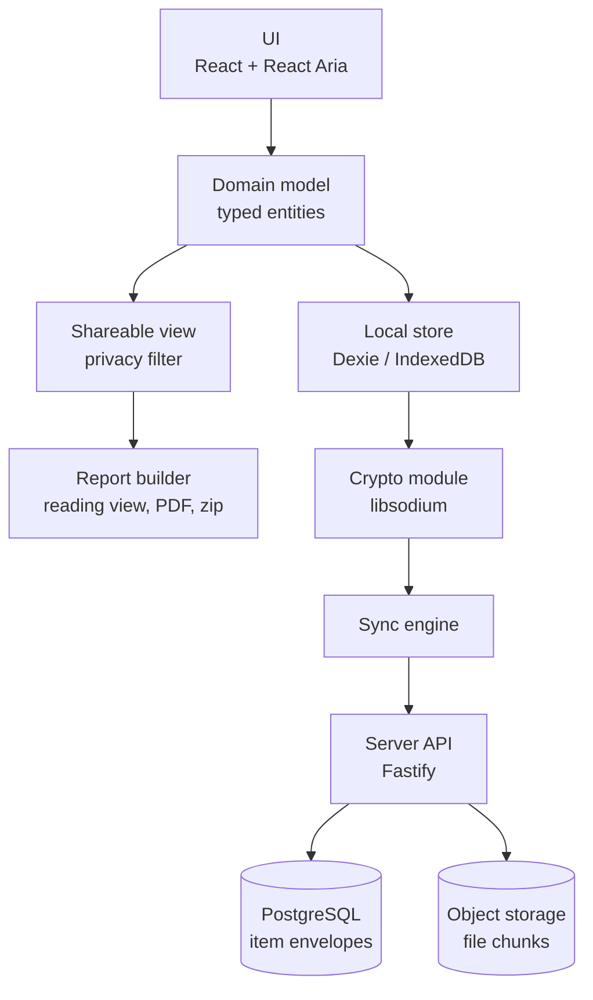
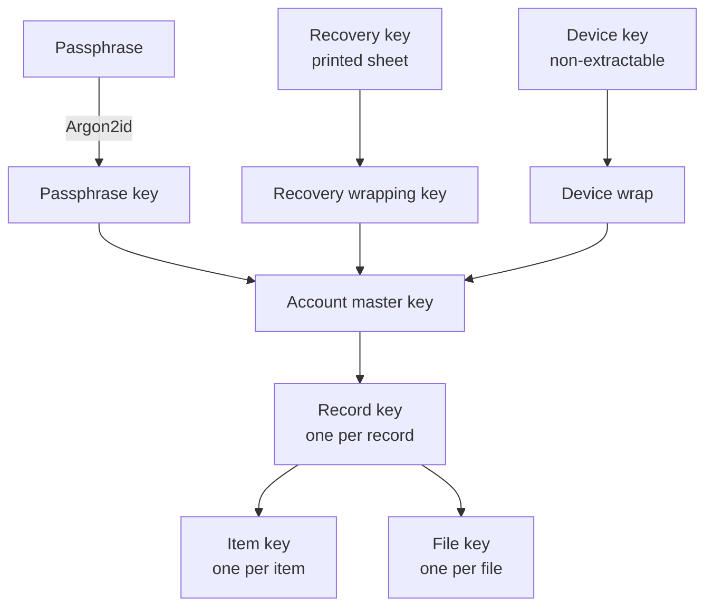
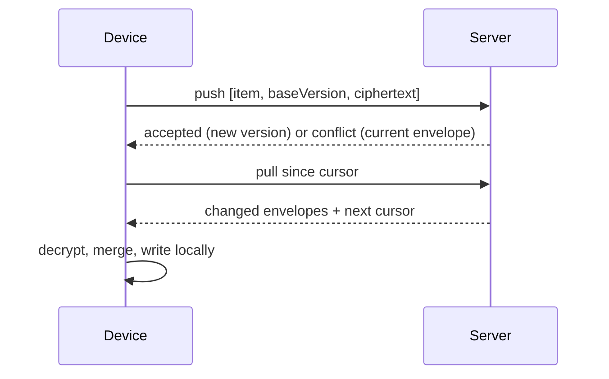
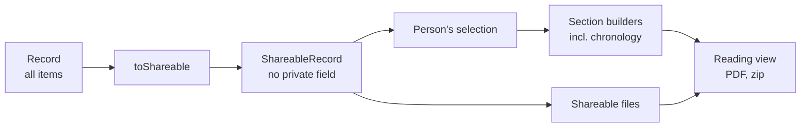
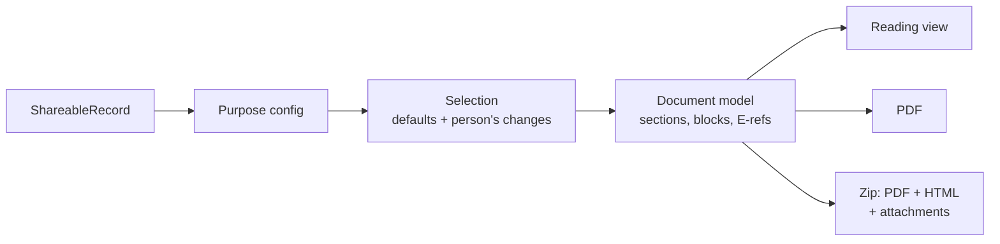

# Say It Once — Architecture

Sep 25, 2026 · @Stuart

## Summary

Say It Once becomes a local-first, end-to-end encrypted web app: the device holds and processes the record, and the server stores only encrypted items it cannot read. This document fixes the parts that are expensive to change later — the key hierarchy, the sync protocol, how records map to encrypted items, and the single place where privacy is enforced. It builds on the [current-app specification](https://claude.ai/code/artifact/20167006-bfd3-4fa9-9185-e70473bfd75b) and its Decisions table.

Five rules shape everything below:

1. **The server never sees content.** Not text, file names, dates, section names or private flags. It sees account email, item IDs, sizes, versions and timestamps.
2. **A save either succeeds or visibly fails.** No fallback storage, no optimistic success message.
3. **Privacy is enforced in one function.** Every output passes through it; nothing else decides what is shareable.
4. **Deleting destroys keys.** Every copy of deleted content is unreadable, including server backups once they expire.
5. **Sync is optional.** Device-only works with no account, and says clearly what that risks.

## Components

The app is layered so that only one module handles plaintext-to-ciphertext and only one decides what may leave the device.



| Component | Responsibility | Never does |
| --- | --- | --- |
| UI | Screens and dialogs from the spec; reads and writes through the domain layer | Touches storage, keys or network directly |
| Domain model | Typed entities, validation, IDs, timestamps, history rules | Know about encryption or sync |
| Local store | Plaintext entities and file Blobs on the device; one serialised write queue | Silently fall back to memory |
| Shareable view | Produces a copy of a record with every private item and its traces removed | Get bypassed — reports cannot import the raw store |
| Report builder | Turns the shareable view into sections, then into outputs | Parse text to find structure |
| Crypto module | Key derivation, wrapping, item and file encryption | Log, persist or send keys in the clear |
| Sync engine | Pushes local changes as encrypted items, pulls and merges remote ones | Decide merge policy for content (it asks the domain layer) |
| Server API | Auth, item envelopes with version checks, file chunk storage, deletion | Hold any key or any plaintext content |

The boundary between Local store and Report builder is enforced by module structure: the report package only receives the shareable-view type, which has no `private` field to forget to check.

## Key hierarchy and cryptography

One random account key unlocks everything; the passphrase, the recovery key and each signed-in device are three independent ways to unlock it. Changing any of them re-wraps one small key and never re-encrypts data.



| Key | Created | Stored where | Wrapped by |
| --- | --- | --- | --- |
| Account master key (AMK), 256-bit random | When sync is switched on | Server: three wrapped copies. Device: wrapped by device key | Passphrase key, recovery key, device key |
| Passphrase key | Derived at each unlock | Never stored | — (Argon2id of passphrase + per-account salt) |
| Recovery key, 256-bit random | With the AMK, and on request | Only on the printed or saved sheet | — |
| Device key | Per browser on sign-in | IndexedDB as a non-extractable WebCrypto key | — |
| Record key, 256-bit random | Per record (incident) | Server and device, wrapped | AMK |
| Item key, 256-bit random | Per item, new on every save | Inside the item envelope, wrapped | Record key |
| File key, 256-bit random | Per file | Inside the file envelope, wrapped | Record key |

**Primitives** — libsodium only: Argon2id (`crypto_pwhash`) for the passphrase; XChaCha20-Poly1305 AEAD for items and key wrapping, with random 192-bit nonces; `secretstream` in 64 KiB chunks for files. No custom primitives. The device key is the one exception: WebCrypto AES-GCM, because only the browser can hold a non-extractable key. Details of the built module, its formats and test vectors: `docs/crypto-review.md`.

**Binding** — every ciphertext carries associated data of `accountId | recordId | itemId | version | envelope type`, so the server cannot swap one item's ciphertext for another's or replay an old version as new.

**Argon2id parameters** — start at 3 passes and 64 MiB of memory, calibrated on the slowest target phone to finish under two seconds. Parameters are stored per account so they can be raised later on the next passphrase change.

**Passphrase rules** — at least 12 characters or a generated four-word phrase offered by default; checked against a common-password list on the device; pasting and password managers allowed; show/hide toggle. *Built in Stage 7:* NFKC-normalised before hashing; the 10,000 most common passwords, including with digits or symbols added at either end; runs along digits, the alphabet or a keyboard row refused; the generated phrase is four words from the EFF long word list.

**Recovery key format** — 256 bits shown as 13 groups of 4 characters (260 bits of capacity) from a 32-character unambiguous alphabet (no 0/O, 1/l), plus a QR code, on a printable "Keep this safe" sheet. Re-issuing it while unlocked invalidates the old one. *Built in Stage 7:* the alphabet is `23456789ABCDEFGHJKLMNPQRSTUVWXYZ` (no 0, O, 1, I); the 4 spare bits are a check (from BLAKE2b of the key) that catches most typing mistakes; the wrapping key is derived from it with libsodium's KDF. The QR code can be drawn by pdfmake, which is already used.

**Size padding** — item ciphertexts are padded to the next multiple of 512 bytes so the server cannot tell a one-word note from a one-line one. File sizes are visible; that is accepted.

**Independent review** — this section and the sync section go to an external reviewer before any user data is stored.

## Account, sign-in, unlock and recovery

Signing in proves who you are; unlocking proves you can read the record. They are separate so that the server never receives anything derived from the passphrase.

| Flow | Steps | Notes |
| --- | --- | --- |
| Device-only start | Open the app, start writing. No account. | Persistent banner on Privacy & backup: "Only on this phone. If the phone or browser data is lost, so is your record." (Taken off Home on 26 September 2026 to keep Home calm; the backup reminder still appears on Home when a backup is due.) One tap to turn on sync. |
| Turn on sync | Enter email → 6-digit code by email (10 minutes, 5 attempts) → choose passphrase → recovery sheet shown → confirm by typing the last group of the recovery key → initial upload with progress | The confirmation step cannot be skipped. The sheet offers Print, Save as PDF and Share. |
| Everyday use on a signed-in device | Opens straight into the record | The device key unwraps the account key. No passphrase prompt. |
| New device or installed app | Email → code → passphrase or recovery key → download | Shows "Downloading your record — 34 of 120 items". Usable as soon as items arrive; files download on demand. |
| Forgot passphrase, another device still signed in | On that device: Privacy & backup → Set a new passphrase | Nothing is lost. |
| Forgot passphrase, no signed-in device | Sign in → Use recovery key → set new passphrase | Nothing is lost. |
| Lost passphrase, recovery key and every device | Sign in → "I can't unlock my record" → explains the record cannot be recovered by anyone → option to delete the old encrypted data and start again | Requires typing a confirmation phrase. Never automatic. |
| Lost or stolen device | From any other signed-in device: Devices → Sign out that device | Session revoked immediately; the device wipes its local copy when it next connects. It cannot be wiped if it never reconnects — stated plainly in the UI. |
| Change email | Only from an unlocked device, with a code sent to both addresses | Prevents takeover by someone who only has the email account. |
| Delete account | Unlocked device, typed confirmation | Deletes every envelope, file and wrapped key; see Deletion. |

**Sessions** — `HttpOnly`, `Secure`, `SameSite=Strict` cookie; 90-day rolling expiry per device; device list shows name, last seen, sign-out. Rate limits on codes per email and per IP. *Built in Stage 8a:* codes and session tokens are stored only as hashes; limits are kept in the database (5 codes per email and 20 per IP an hour; 30 wrong codes per IP an hour); a device signed out from elsewhere is told "signed-out" once, so it can wipe its copy. Details: `docs/server.md`.

**Why a code, not a magic link** — on iOS a tapped link opens Safari, not the installed app, recreating the storage split the rebuild must fix. A code is typed into whichever context asked for it.

**Passkeys** — added later as an alternative to email codes for sign-in only. They do not replace the passphrase for unlocking. (Deriving keys from passkeys depends on the WebAuthn PRF extension, which is not yet dependable across the phones this audience uses.)

## Data model as encrypted items

Each thing a person adds or edits on its own is one item. The unit of encryption, sync, conflict and deletion is the same, which keeps all four simple.

**Server envelope** (the only shape the server knows):

```
item_id        uuid (random v4)
account_id     uuid
record_id      uuid, or null for account-level items
version        integer, server-assigned, +1 per accepted write
deleted        boolean (tombstone)
wrapped_key    bytes   item key wrapped by the record key
nonce          bytes
ciphertext     bytes   padded to a multiple of 512
updated_at     server timestamp
written_by     device id
```

**Plaintext payload** (inside the ciphertext): `{schema, type, data, private, createdAt, updatedAt}`. The type is inside, so the server cannot count appointments versus medications.

| Item type | One per | Data (fields from the spec) | Private control |
| --- | --- | --- | --- |
| `profile` | Account | Person's name, display preferences worth syncing | — |
| `recordMeta` | Record | Name, created, impactCurrentSince | — |
| `incident` | Record | The 13 incident fields | No (Q13) |
| `impactArea` | Area per record | areaKey, difficulty, detail, help, aid, often, safety, timeLonger, standard | Yes |
| `impactNote` | Record | Free text "something else this has changed" | Yes |
| `impactSnapshot` | Change | Date, copies of the area and note items as they were, each with its item ID | Follows the live items (see Privacy filter) |
| `checkIn` | Check-in | Date, pain, feeling, pulse (no longer asked for since 1 October 2026; kept if saved before), note | Yes |
| `appointment` | Appointment | Date, time, organisation, person, purpose, location, type, told, next, documentId | Yes |
| `treatment` | Treatment | Name, date, effect, note | Yes |
| `medication` | Medication | Name, forWhat, status, dose, often, started, effect, sideEffects | Yes |
| `cost` | Entry | Kind, date, dateTo, item, amount (integer pence), evidence, documentId | Yes |
| `document` | Document | Title, from, date, point, wording, paperCopy, actBy, done, relatedTo `{type, id}`, fileId, file name/type/size | Yes |
| `contact` | Contact | Organisation, role, reference, phone/email | Yes |
| `quickNote` | Note | Text, filedTo `{section, impactArea}`, photoFileId | Yes |
| `workDetails` | Record | The IIDB fields | No |

**Changes from the old model** — amounts become integer pence, not strings; derived duplicates (`who`, `what` on appointments) are dropped; legacy diary notes become Quick Notes (Q11); corrections overwrite (Q9); `revisions`, `sealed`, `sectionStates` and `productMeta` are dropped.

**Device-only data, never synced** — unsaved form drafts, the "Add to phone" dismissal, and search history (kept per record in IndexedDB and deleted with the record; D12).

**Schema versions** — `schema` is an integer per item. Clients migrate older payloads on read and write them back at the new version. A client that meets a newer schema than it knows shows the item read-only with "Update Say It Once to edit this".

## Local storage and save guarantees

A change is "saved" only when the IndexedDB transaction that holds it has committed; until then the UI says "Saving…", and if it fails the UI says so and keeps the person's text on screen.

**Tables (Dexie)** — `items` (decrypted payload, item ID, record ID, type, base version, sync state `clean` / `dirty` / `conflict`), `files` (Blob, file ID, upload/download state), `outbox` (ordered item IDs awaiting push), `keys` (wrapped account key, device key handle), `local` (drafts, search history, preferences).

*Build note (Stage 2, agreed 25 September 2026):* the device-only app has `items`, `files` and `local`. The `outbox` and `keys` tables, the sync fields on items (base version, sync state) and the file upload/download state are added with a tested database upgrade when encryption and sync are built (Stages 7 to 9), so nothing sits empty or queues changes that nothing will send.

**The write path**

1. Every change goes through one queue, one transaction at a time, so writes never complete out of order (D6).
2. The transaction writes the item and its outbox entry together; both commit or neither does.
3. On commit, the form's status reads "Saved". On failure — storage full, browser blocking storage, database closed by the system — a persistent message explains what happened and what to do, and the text stays in the field.
4. Nothing ever falls back to memory, `localStorage` or anything else.

**Typing** — long text fields save 800 ms after typing stops, and immediately on leaving the field, switching tab, or the page being hidden (`visibilitychange`, `pagehide`). Each form shows a quiet status line; errors are not toasts.

**Start-up check** — the app opens the database and writes and reads a probe. If storage is unavailable, it opens read-only with an explanation, instead of letting someone write into a void. It requests persistent storage (`navigator.storage.persist()`) at the first save and shows available space in Privacy & backup.

**Several tabs** — Dexie's live queries keep tabs in step; a Web Lock ensures only one tab runs sync at a time.

**Encryption on the device** — none in version 1 beyond the wrapped account key. Anyone who can open the unlocked phone and browser can read the record, as today. This is stated in Privacy & backup. An optional app PIN is a later feature. (Q4)

## Sync protocol

Sync is push-then-pull of whole encrypted items with a version check on every write; the server never merges, and the client merges with the rule "never silently lose someone's words".



**Endpoints**

| Call | Request | Response |
| --- | --- | --- |
| `POST /v1/sync/push` | Up to 100 envelopes, each with `baseVersion`; a request ID for safe retries | Per item: `accepted {version}` or `conflict {current envelope}` or `gone` (item deleted) |
| `GET /v1/sync/pull?cursor=` | Cursor from the last pull | Up to 500 envelopes changed since, in account-wide change order, plus the next cursor |
| `PUT /v1/files/{fileId}/chunks/{n}` and `POST …/complete` | Encrypted chunks | See Files |
| `DELETE /v1/records/{recordId}` | — | Tombstones every item in the record and deletes its key and files |

The server keeps a per-account change sequence. A write is accepted only if `baseVersion` equals the current version (0 for a new item). This is compare-and-set, so two devices can never overwrite each other unnoticed.

**When sync runs** — after a change (2-second debounce), on opening the app, when the network returns, and every 5 minutes while visible. Browser background sync is not relied on because iOS does not support it.

**Merge rules on conflict** — the client keeps the last-synced copy of each item as the merge base.

| Situation | Result |
| --- | --- |
| Different fields changed on each device | Both changes kept, pushed as a new version |
| Same non-text field (date, status, choice) changed | Most recent edit wins |
| Same text field changed differently | Item marked "Changed on two devices"; the person sees both versions side by side and chooses or combines. Nothing is discarded until they do. |
| Private flag differs | Private wins — the safe outcome |
| Deleted on one device, edited on the other | Deletion wins; the editing device shows "Deleted on another device" with "Keep my changes as a new item" |
| Same impact area created on two devices | Merged into one item by area key using the rules above |

**Tombstones** — a deleted item keeps only its ID, version and deleted flag on the server, with no key or ciphertext, until the account is deleted. This stops an offline device from resurrecting it.

**Status shown to the person** — "Backed up 2 minutes ago", "3 changes waiting — you're offline", or "Couldn't back up — tap for details". Never a spinner that hides failure.

**Turning sync on with an existing record** — items are pushed in batches with a visible count, files afterwards; the app is usable throughout.

## Files and attachments

Files are encrypted and moved in 64 KiB chunks, so no step ever needs a whole file — let alone every file — in memory at once. This fixes the backup defect by design.

- **On the device** — stored as the original Blob, never base64. Originals are kept unchanged because they may be evidence. Thumbnails are made on the device and never synced.
- **Size limit** — 25 MB per file, stated before the person picks a file, with a plain message if exceeded. (Q5)
- **Encryption** — each file gets its own key, wrapped by the record key; `secretstream` produces a header and authenticated chunks, so a truncated or reordered file fails to decrypt instead of opening corrupted.
- **What the server stores** — object key = random file ID; chunk count; total size. *Stage 8 decision (26 September 2026):* the chunks are kept in PostgreSQL for now, which keeps one thing to run and back up; moving them to object storage later doesn't change the API. The file name, type and which item it belongs to live only inside the encrypted `document` or `quickNote` item.
- **Upload** — chunks go through the API to object storage; each chunk is idempotent, so an interrupted upload resumes where it stopped. A file becomes visible to other devices only after `complete` confirms every chunk arrived. Until then the item shows "File still uploading from your other device".
- **Download** — on demand when opened or when a report needs it; decrypted as a stream straight into a local Blob. A "Keep all files on this device" setting pre-fetches everything for offline use.
- **Opening a file** — from a local Blob URL in the app; on iOS standalone, via the share sheet, with success reported only if the share completes.

## Deletion

Deleting removes content from the device at once, from the live server at the next sync, and from server backups within 30 days; the only copies that survive are reports the person already sent to someone.

| Deleted | Also removed | Also updated |
| --- | --- | --- |
| Any item | Its local row, its outbox entry, its search-history entries; on the server its ciphertext and wrapped key (tombstone left) | — |
| Document | Its file locally and on the server | Appointments and costs that pointed at it lose the link (new versions pushed) |
| Appointment | — | Asks: "Also delete the letter saved with it?" (Q6) |
| Quick Note | Its photo, unless the photo was already made into a document | — |
| Impact area or impact note | Its copies inside every impact snapshot | Snapshots are rewritten so no earlier version survives |
| Record | Every item, file and search entry in it, its record key, local drafts | — |
| Account | Everything above for every record, all wrapped account keys, sessions, devices, email address | — |
| Device-only data | The IndexedDB database for the app | — |

**Server backups** — nightly database dumps and a second-location copy of file chunks are kept for 30 days, then destroyed. Deleted content can exist in those encrypted backups until they expire. This is stated in the privacy notice and in the delete confirmation ("Removed now. Encrypted backup copies are destroyed within 30 days."). Object storage has versioning off so a deleted object has no hidden older version.

**What deletion cannot reach** — PDFs, zips and printouts the person already created or shared. The delete confirmation says so when the item has appeared in a report created on this device.

**Tests** — for each row above, a test creates the item with a file and history, deletes it, and asserts that no row, Blob, key, ciphertext, file object or search entry remains, locally and on a test server.

## Privacy filter

One pure function, `toShareable(record)`, is the only way data reaches any output. It runs before selection, before the chronology is built and before any file is read, so there is nothing downstream that could forget to check a flag.



**What `toShareable` removes**

1. Every item with `private: true`, of every type.
2. Every trace of a removed item: links from appointments and costs to a private document; a document's `relatedTo` pointing at a private item; copies of a private impact area or note inside impact snapshots (matched by item ID, using the flag as it is *now*, which fixes D3).
3. Quick Notes filed anywhere, if private, and their photos.

**How bypass is prevented**

- `ShareableRecord` and its item types have no `private` field and are a distinct TypeScript type; report code accepts only that type.
- A dependency rule in CI fails the build if anything under `reports/` imports the local store, the sync engine or the raw record types.
- Files for outputs come only from `shareableFiles(view)`, which takes a `ShareableRecord`.
- The person's selection ("choose specific entries", "find something else to add", search → "use these results") is made from the shareable view, so a private item can never be offered, pre-ticked or added (fixes D2).

**What the person sees** — review screens say "4 private items are not included" with a link to the list in the app, never showing their content in the output.

**Tests that prove it**

- **Property test (fast-check)** — generates thousands of random records covering every item type, links, snapshots, Quick Notes with photos and files. Every text field contains a unique marker word; every file contains unique bytes. Private flags are random. For every purpose and every output (reading view HTML, PDF text, zip file names and contents), it asserts that no marker or byte sequence from a private item appears, and that every marker from a selected, non-private item does appear — so over-filtering fails too.
- **Regression fixtures** — the exact situations behind D1 (chronology), D2 (Evidence Pack documents) and D3 (snapshots).
- **Late marking** — marking an item private after it appears in a snapshot removes it from every future output.
- These tests run on every commit and block a release if they fail.

## Report pipeline

Reports are built once as a typed document model and then drawn by three renderers, so structure is never reconstructed from text and all three outputs contain exactly the same content.



**Purpose config** — each purpose is a data object, not code: title, intro sentence, audience, kind (summary or evidence), ordered sections, per-section default rule and limit (for example "all non-private appointments, newest first, up to 6"), and whether it ends with the signature block (Q14: Full Record and Evidence Pack only). The list follows the audience → need model in the spec's Decisions. Adding or changing a purpose is a config change with a test, not a new code path.

**Document model** — `Section {key, title, blocks[]}`. Block types: heading, label/value pair, paragraph, dated entry, list, document reference. Evidence references E1, E2… are assigned once here, in date order, and every renderer uses them.

**Chronology** — built inside the model from the selected shareable items, so it cannot include anything the person did not choose or anything private.

**Personal-information warning** — computed from structured categories in the model (toilet and mixing-with-people areas, check-ins, costs), shown in review and final check for every output (Q15).

**Renderers**

| Output | Built with | Notes |
| --- | --- | --- |
| Reading view | React components | The accessible version: real headings, lists and tables; works with screen readers and the app's text size; Read aloud uses the device voice. |
| PDF | pdfmake, fonts embedded | Page numbers, contents page, E-refs, signature block where configured. Not a tagged PDF, which is why the zip also carries HTML. |
| Zip | fflate, streamed | `report.pdf`, `report.html` (self-contained, no scripts), `attachments/E1-name.ext`… |

**Delivery** — through the share sheet where available, otherwise a download. The result says only what is known: the share sheet reports that the file was passed to an app, not that it was sent, and browsers never report that a download finished, so the app says "Passed to the app you chose" or "Your browser is saving …", and "Not sent" when the share sheet is closed without choosing (decided 26 September 2026). Everything runs on the device and works offline.

**Tests** — snapshot tests of the document model for each purpose against fixture records; a check that all three renderers contain the same text and the same E-refs; the privacy property test from the previous section.

## Importing from the old app

Update 25 September 2026: no one, including testers, holds real data in the old app, so import from the old app is not built. This section is kept only as a record of the old format. Export from the new app is still built. Import only ever adds: it creates new records and never replaces or merges into existing ones, which fixes the orphaning defect by design. Every problem is reported; nothing is skipped silently.

**Two ways in**

1. **In place, automatically offered.** If the new app is served from the same address as the old one, it can read the old IndexedDB database (`say-it-once-v53-fresh-new-user`) on first run. This includes an old home-screen app on iOS, because the new code loads into the same storage the old app used. The person sees "We found your existing record — bring it across?" No file handling needed. **This is the main route and needs the new app on the same domain (Q1).**
2. **From a backup file** — the v53 format and the legacy single-record format from the spec, chosen from Privacy & backup or at first run.

**Steps**

1. Read and validate. Backup files are parsed as a stream, one record and one file at a time, so a large backup never needs to fit in memory twice.
2. Preview: "2 records · 41 appointments · 17 documents · 2 documents are missing their file". The person confirms.
3. Transform each record to the new item model, one record per transaction — a record imports completely or not at all.
4. Summary screen listing anything that needed attention.

**Transformation rules**

| Old | New |
| --- | --- |
| Normalisation and vocabulary renames from the spec | Applied first |
| Amount strings | Integer pence; unparseable amounts keep the original text in the item's description, amount left empty, listed in the summary |
| Legacy diary notes | Quick Notes filed under Appointments, date kept (Q11) |
| `impactHistory` snapshots | Snapshot items pointing at the new impact area and note item IDs by area key |
| `::safe` redacted copies | Separate documents titled "{title} (safe-to-share copy)", with the original's private setting (Q6) |
| Appointment `docId`, cost `docId`, document `relatedSection`/`relatedId` | Links to the new item IDs; `relatedSection` without an ID becomes a section-level link |
| `private` on any item, including costs and contacts | Kept |
| `revisions`, `sealed`, `sectionStates`, `productMeta`, `drafts`, `who`/`what` duplicates | Dropped |
| Document with file metadata but no file in the backup | Imported without a file, marked "File not found in backup" |

**Re-importing the same backup** — each imported record remembers its source record ID; importing it again offers "Skip" or "Import as a separate copy".

**Export from the new app** — a zip with a readable `manifest.json`, one JSON file per record and the original files. It is plaintext and says so. It serves as the person's own backup, as data portability, and as the in-app answer to a subject access request. It includes entries marked private, since it is the person's own copy (decided 26 September 2026). Restoring it only ever adds records, with new IDs, checked and summarised before anything changes; it is also how a record moves from a Safari tab to the home-screen app while there is no sync.

**Tests** — fixture backups from every old build you can supply plus anonymised real ones, a legacy single-record backup, a truncated file, missing attachments, a duplicate import, and a 300 MB synthetic backup run under a memory cap. Each fixture has a golden expected result; a round trip (old backup → import → export) checks every field and link count.

## Devices, iOS and offline

Every browser context — a Safari tab, a home-screen app, a second phone — is treated as a separate device that gets the record by signing in. That single rule is how the iOS home-screen problem is handled explicitly rather than by luck.

**The iOS transition**

| Situation | What the app does |
| --- | --- |
| Opened with no local data | First screen asks: "Already use Say It Once? Sign in to bring your record here" or "Start a new record". Never shows an empty record as if it were theirs. |
| Safari tab with a device-only record, person taps "Add to phone" | Explains that the home-screen app has separate storage, and asks them to turn on backup first. Only then shows the Add to Home Screen steps, followed by "Open the new icon and sign in". |
| Old app data exists in both Safari and the home-screen app | Each context offers its own import; both carry the same source record ID. When the second arrives in the account, the person chooses "Keep both" or "Keep the one updated most recently". |
| Device-only record in a Safari tab | Warned that Safari may clear website data after about 7 days without a visit; nudged to turn on backup or install. |

**Offline** — the app shell is precached by a service worker (Workbox through `vite-plugin-pwa`). On a device that is signed in and unlocked, everything works offline: adding, editing, searching, building and saving reports. Changes queue and sync when the connection returns. The one exception, stated in the spec: a brand-new device needs a connection once to sign in and download.

**Updates** — a new version installs in the background and waits. The app offers "Update ready — restart" only when no form has unsaved changes, and never restarts on its own mid-edit. Local database changes are versioned Dexie migrations with tests from every previous version.

**Browser support** — iOS Safari and home-screen apps, Chrome on Android, Samsung Internet, and current desktop browsers. The minimum iOS version is **Q2**; it decides which storage and share-sheet behaviours can be relied on.

## Threat model

The design protects record content from everyone on the server side, including you; it does not protect against someone holding the unlocked phone, and in a web app it depends on the code you deploy being honest.

| Threat | Protected? | How, or why not |
| --- | --- | --- |
| Database or backup stolen | Content yes; metadata no | Ciphertext only. Exposed: email addresses, item counts, padded sizes, timestamps, the fact of using a recovery app. |
| Hosting staff, or a legal order served on you | Content yes | You hold no keys. You can hand over only what a stolen database would show. |
| Stolen database + weak passphrase | Partly | Offline guessing against Argon2id; passphrase rules and the generated-phrase default reduce the risk. |
| Someone takes over the person's email | Content yes | They can sign in but cannot unlock. Unlocking, device management, email change and account deletion all need an unlocked device or recovery key. |
| Network attacker | Yes | TLS plus end-to-end encryption. |
| Your deployment compromised, malicious code served | **No** | Mitigated only: no third-party scripts; strict Content Security Policy; releases only from signed CI builds; installed app keeps cached code until the person accepts an update; published source lets others check (Q3). |
| Someone with the unlocked phone | **No** | Same as today. Relies on the phone's lock. Optional app PIN later (Q4). |
| Stolen locked phone | Mostly | Relies on the phone's own storage encryption. The person can sign that device out remotely. |
| Someone the person lives with, who may be the subject of what they record | **No, and important** | They may know the phone PIN or the passphrase. An app PIN and a discreet display name are the realistic mitigations; worth researching with users before launch (Q4). |
| Report recipients passing it on | Out of scope | Outputs are plaintext by nature; the review steps and warnings are the only control. |
| Speech recognition vendors | Yes | In-app dictation removed; the phone keyboard's own dictation is suggested instead. |

**Rules for the codebase that follow from this** — no analytics, no third-party scripts or fonts at runtime, error reports stripped of all content before leaving the device, no logging of request bodies on the server, secrets and deploy keys in the CI provider only.

## Compliance notes

These are engineering notes on what the design makes easy or necessary, not legal advice; the DPIA and privacy notice should be checked by someone qualified before launch.

- **Your role** — you are a controller for account data and metadata. Treat stored ciphertext as personal data too; it is the cautious reading.
- **Lawful basis** — contract for accounts and sync. Because metadata can imply a health context, take explicit consent when sync is switched on as an additional safeguard.
- **DPIA** — write it before launch. The design keeps it manageable: the risk section is mostly about metadata, deployment integrity and recovery loss.
- **ICO** — pay the data protection fee.
- **Processors** — data processing agreements with the host and the email provider; hosting in Germany or Finland (EU).
- **Privacy notice** — plain language: what the server can and cannot see, the 30-day backup window, that lost keys mean lost data, that nobody at Say It Once can read or recover content.
- **Subject access requests** — answer with account data, metadata, the ciphertext and an explanation of why it cannot be read, pointing to the in-app export for the readable copy. Keep a template.
- **Breach plan** — written before launch: how to assess, the 72-hour ICO clock, and wording for users. A ciphertext-only breach will usually carry lower risk, but it still needs assessing.
- **Not a medical device** — keep the rule the current app follows: the app records and organises, and never interprets, scores or advises on health. Anything that does could bring it under medical device software regulation.
- **Accessibility** — target WCAG 2.2 AA, tested with real assistive technology each release.
- **Age** — terms need a minimum age for accounts (Q7).

## Open questions

These are the decisions this design needs from you; my recommendation follows each.

1. **Q1 Same domain.** Will the new app live at the same address as the current one? Recommended: yes. It lets existing users' records be brought across automatically, including from iOS home-screen apps, without anyone handling a backup file.
2. **Q2 Minimum iOS version.** Recommended: the two latest major versions at launch. Older versions get the app but with a notice that file sharing may not work.
3. **Q3 Publish the source?** Recommended: publish the client code. It lets others verify the encryption claims and costs you nothing in an end-to-end design, since the server holds nothing readable. The server can stay private.
4. **Q4 App lock and discreet mode.** Recommended: plan an optional app PIN and a neutral display name for version 1.1, and ask users about the "person I live with" risk before building them.
5. **Q5 File size and storage.** Recommended: 25 MB per file and a generous per-account allowance (for example 2 GB). This depends on Q9.
6. **Q6 Deleting an appointment with a letter.** Recommended: ask each time, defaulting to keeping the letter, because a letter can matter as evidence after the appointment has gone.
7. **Q7 Minimum age.** Recommended: 18 for accounts, since the content and purposes are adult-facing (benefits, claims, employers). Device-only use can't be age-checked either way.
8. **Q8 In-app dictation.** Recommended: remove it and point to the keyboard's microphone. Confirm, because some current users rely on the Dictate button.
9. **Q9 Who pays for hosting?** Free, donations, a charity partner or a paid tier? Recommended: decide before launch, because it sets the storage allowance, the support promise and whether the privacy notice mentions a partner.
10. **Q10 Independent crypto review.** Recommended: budget for a short external review of the key hierarchy and sync design before real data is stored.

## Decisions

All ten recommendations were accepted on 25 September 2026. Q9 had no single recommendation, so it carries a working assumption that must be settled before launch.

| Q | Decision |
| --- | --- |
| Q1 | No live users hold data (confirmed 25 September 2026), so nothing needs migrating in place and the address can change if useful. In-place import is dropped. |
| Q2 | Support the two latest major iOS versions at launch; older versions get a notice about file sharing. |
| Q3 | Client source published; server private. |
| Q4 | App PIN and discreet display name planned for 1.1, after user research on the "person I live with" risk. |
| Q5 | 25 MB per file; per-account allowance configurable, 2 GB to start. |
| Q6 | Deleting an appointment asks about its letter, defaulting to keep. |
| Q7 | Accounts are 18+. |
| Q8 | In-app dictation removed; the keyboard microphone is suggested instead. |
| Q9 | **Working assumption:** free at first, paid eventually. Device-only stays free; accounts carry a plan field from day one; no one ever loses the ability to read, export or delete their own record because they stopped paying. Pricing model still to decide. |
| Q10 | External review of the key hierarchy and sync design before real data is stored. |

## Build plan

**Paused after Stage 8a (26 September 2026).** Stages 8b, 9 and 10 need a paid server, web address and cryptography review. Until funding is found, Say It Once is device-only; the 8a server code is kept and tested. See the CLAUDE.md decision of that date.

Build the device-only app first and release it as a replacement for the current one, then add accounts and sync; each stage ends with something you can run and review, and I stop for your sign-off before the next.

The reasoning for the split: stages 1–6 fix every known defect and the privacy leaks without touching servers, keys or accounts. With no live users, stage 6 is a release to testers rather than the public, and the hardest, least reversible work (encryption and sync) is built on a foundation already proven with real data.

| Stage | Delivers | You review | Size |
| --- | --- | --- | --- |
| 0. Hotfix (optional, separate) | Done 25 September 2026, outside this repository: a patch to the old app for D1, D2 and D3 with a privacy test. It does not belong in this repository and is not part of the rebuild. Deploying it is optional as no live users hold data | The patch and a before/after test | S |
| 1. Foundations | Repository, TypeScript, Vite, React, React Aria; CI with type checks, lint, tests, the reports-import rule and axe; accessible dialog, field, status-message and confirm components; text size scaling from the root | App shell with Home and Privacy screens; a keyboard and VoiceOver walkthrough | M |
| 2. Domain and local store | All item types from the data model; validation; the single write queue; visible save and failure states; persistent storage request | Unit tests; forcing storage failures and seeing honest errors | M |
| 3. Screens | Every screen and dialog from the spec, device-only: What happened, How it affects me with snapshots, Keep track sections, Quick Notes and filing, Find, contacts and calendar export, support directory, FAQ, How to use | Clickable app against the spec, screen by screen | L |
| 4. Privacy filter and reports | `toShareable`, purpose configs, selection, document model, reading view; the property tests | Tests passing; generated reports for each purpose | M |
| 5. PDF, zip and delivery | pdfmake and fflate outputs; share-sheet delivery with honest results; tested on iOS standalone | Real PDFs and zips from real phones | M |
| 6. Import and device-only release | Export; release to testers | Tester feedback | M |
| 7. Crypto module | Key hierarchy, passphrase and recovery key, item and file encryption, test vectors; material for the external review | Review pack sent to the reviewer | M |
| 8. Server | Fastify API, Postgres schema, email codes, sessions, envelopes, file chunks, deletion, rate limits; Hetzner set-up, backups and a tested restore | API tests; a restore drill | M |
| 9. Sync | Push/pull, merge rules, conflict screen, device list, remote sign-out, iOS transition flows, turning sync on for an existing record | Two phones and a laptop editing offline and reconciling | L |
| 10. Hardening and launch of sync | Fixes from the crypto review; VoiceOver and NVDA audit; recovery-sheet testing with real users; DPIA, privacy notice, breach plan; low-end phone performance | Go/no-go checklist | M |

**Sizes** are relative (S, M, L), not weeks; I'll estimate each stage properly at its start, once the previous one has shown how the work is going.

**Fixtures I'll need from you** — none from old builds, since import is not built. Before stage 4, a few realistic made-up records covering each purpose, to test reports against.
